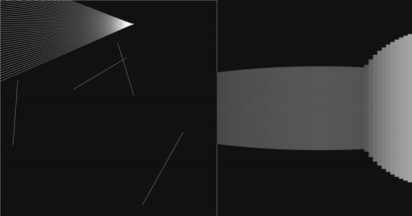
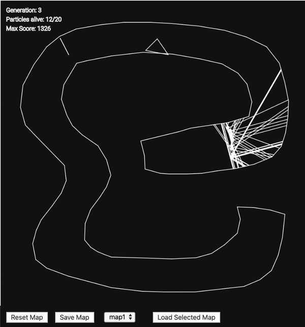

# RayCasting
A p5.js genetic algorithm / artificial-neural-network using ray-casting with semi-3d visualization

## Table of contents
* [General info](#general-info)
* [Screenshots](#screenshots)
* [Technologies](#technologies)
* [Features](#features)
* [Inspiration](#inspiration)
* [Contact](#contact)

## General Info
This project is a proof-of-concept of ray casting and its uses.
The goal was to both learn JavaScript, and to learn the concept of raycasting.

In order to show to potential use of raycasting, 
the project was converted to a genetic algorithm project,
where particles race to get to the end of a race course.

## Screenshots

## Technologies
* [P5.js](https://github.com/processing/p5.js)
* [mini-ann-js](https://github.com/savvysiddharth/mini-ANN-js)

## Features
* Quickly and easily create new maps
* Save and load maps
* Train the particles, and add obstacles while training

## Status
Project is: _finished_.

## Inspiration
This project was inspired by [Daniel Shiffman](https://github.com/shiffman) in his [ray-casting project](https://thecodingtrain.com/CodingChallenges/145-2d-ray-casting.html).

### Contact
samuel.arbibe@gmail.com